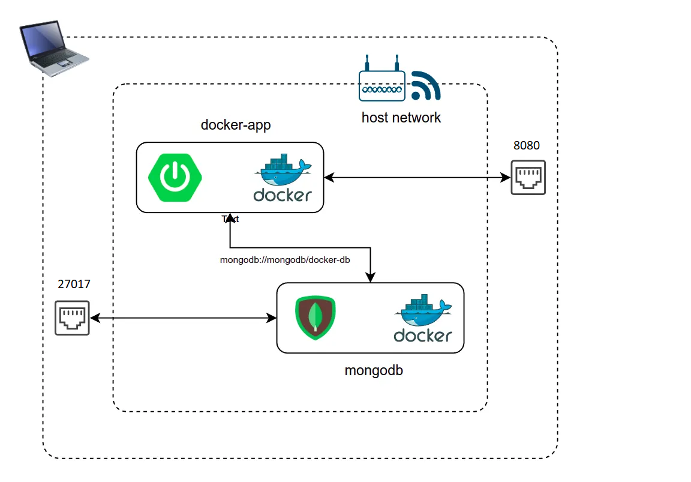

# Read Me First

## Clone the repository

First, you need to clone or download the project from GitHub to your local machine. 

You can do this by using the "Clone or download" button on the GitHub repository page and then choose "Download ZIP" 
or use git command:

  `git clone https://github.globant.com/alan-jimenez/dojo-challenge-team7.git`

Once you have the project files on your local machine, you'll need to navigate to the project directory in your command line/terminal.

If the project is a Java project, you'll need to have the Java Development Kit (JDK) Version 8 installed on your machine. 
You can check if it's installed by running the command:

  `java -version.`

If it's not installed, you can download and install it from the official Oracle website.

Next, you'll need to build the project using a build tool maven.

## Settings of profiles
There are 2 profiles local and prod. The local profile is for working with mongodb locally through 
docker and prod is for mongodb configuration in production.

The default is the production profile, to set the local profile you must go to the ImageProcessingServiceApplication 
class and change the word "prod" to "local".

## Settings of containers

To upload the application and the database in containers, 
you must perform the following steps: 

* Build project

  `mvn clean package -DskipTests`

 > For the following steps you must have docker and docker-compose installed.

* Build Project Docker Image. You must be in the root directory of the project in order 
to run the following command:

    `docker-compose build`

* Create containers and run project. You must be in the root directory of the project in order
  to run the following command:
  
  `docker-compose up -d`

* And finally you have the 2 containers running with a common network to communicate between them.

> In case you want to stop the 2 containers run the following command:
>
> `docker-compose stop`

## API Documentation.

The API documentation is located in the following route: http://localhost:8080/swagger-ui/index.html

# Image Processing API
Image Processing Service

## Version: 1.0

### /image/process

#### POST
##### Summary:

Process Image Request - Process the image to upload the server and send it by email and will return synchronously a RequestId (guid)

##### Parameters

| Name | Located in | Description | Required | Schema |
| ---- | ---------- | ----------- | -------- | ---- |
| image | query |  | Yes | binary |

##### Responses

| Code | Description |
| ---- | ----------- |
| 200 | OK |
| 400 | Bad Request |
| 404 | Not Found |
| 500 | Internal Server Error |

### /image/status/{guid}

#### GET
##### Summary:

Search Process Image Requests - This endpoint will receive as input parameters:
Begin Date (date time)
End Date (date time)
And will return a list of all the Process Image Request received during that datetime range, including: its status, date time of when the processing started and date time of when the processing ended (either as completed or failed).

##### Parameters

| Name | Located in | Description | Required | Schema |
| ---- | ---------- | ----------- | -------- | ---- |
| guid | path |  | Yes | string |

##### Responses

| Code | Description |
| ---- | ----------- |
| 200 | OK |
| 400 | Bad Request |
| 404 | Not Found |
| 500 | Internal Server Error |

### /image/search

#### GET
##### Summary:

Process Image Request Status- This endpoint will receive as input parameter a RequestId (guid) and will return a status (string) that can be:
InProgress: a request has been received but the full process (stage 2 and 3 has not been completed)
Completed: the process defined in stage 2 and 3 has been completed successfully.
Failed: some kind of error or exception has occurred

##### Parameters

| Name | Located in | Description | Required | Schema |
| ---- | ---------- | ----------- | -------- | ---- |
| startDate | query |  | Yes | string |
| endDate | query |  | Yes | string |

##### Responses

| Code | Description |
| ---- | ----------- |
| 200 | OK |
| 400 | Bad Request |
| 404 | Not Found |
| 500 | Internal Server Error |

## Diagram Process Image Request

## Docker architecture

